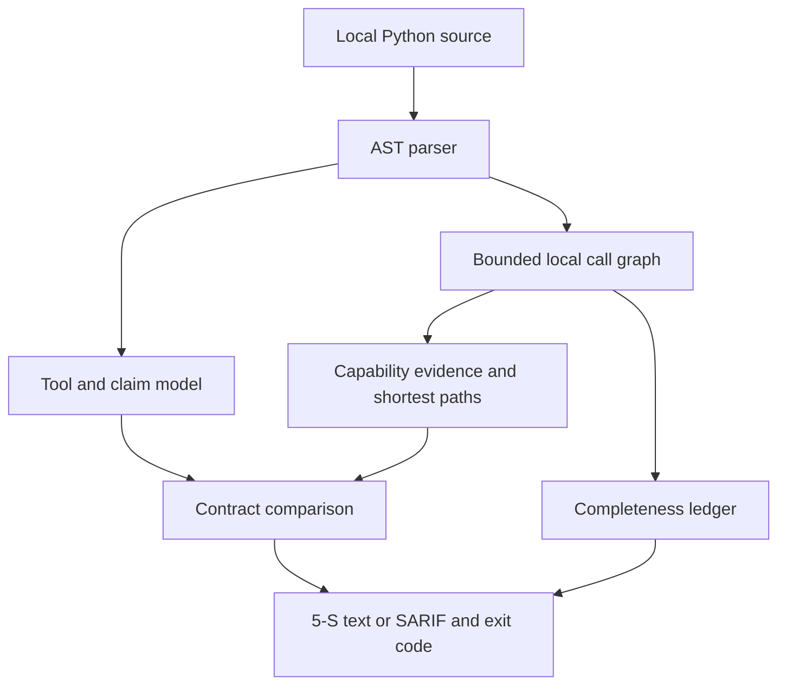

# Architecture and threat model

## Goal

MCP ScopeCheck detects mismatches between a Python MCP tool's declared contract and security-relevant behavior statically reachable from that tool.

## Non-goals

v0.2 is not a general Python SAST engine, malware sandbox, dependency scanner,
MCP client, or runtime policy gateway. It does not execute servers and does not
claim complete program analysis.

## Data flow

The target is data throughout this flow. Nothing imports the target or invokes its decorators.

## Trust boundaries

- **Untrusted:** every byte under the audit target.
- **Trusted:** ScopeCheck's parser, rule engine, renderer, and Python runtime.
- **External systems:** none during a v0.2 audit. The scanner has no network
  feature and no runtime dependency.

## Terminal-output boundary

Every target-controlled value passes through one display escaping function before
it reaches the plain-text report or a normal CLI error. C0 and C1 controls, DEL,
carriage returns, line feeds, tabs, Unicode line separators, and Unicode
bidirectional formatting controls are rendered as visible `\uXXXX` sequences.
Ordinary Unicode remains readable. SARIF uses the same sanitization for untrusted
messages and properties, percent-encodes relative artifact URIs, and never mixes
plain-text diagnostics into JSON stdout.

## Safety limits

- Known dependency/cache/build directories are skipped.
- Individual source files are limited to 1 MB.
- A directory audit is limited to 5,000 Python files.
- All accepted Python source is limited to 20 MB per audit.
- Parsed trees are limited to 500,000 total AST nodes and 200 AST levels.
- At most 100 target diagnostics are retained.
- At most 2,000 local modules may participate in the call graph.
- At most 20,000 resolved local edges are retained per audit.
- At most 256 functions and 32 cross-module hops are followed per tool.
- At most 1,000 capability paths are retained per tool.
- At most 1,000 unresolved edges and 1,000 potential registrations are retained.
- Static decorator metadata accepts only bounded JSON-like values. Each tool's
  metadata is limited to 256 decoded nodes, 12 nesting levels, 16,384 UTF-8
  string bytes, 256-bit integers, and 128 collection items.
- Calls, comprehensions, sets, dictionary expansion, and other executable or
  unsupported metadata syntax are rejected. `ToolAnnotations(...)` is handled
  as an explicitly supported static keyword container; it is never invoked.
- Source-byte limits apply before decoding. Python source is decoded strictly
  using PEP 263 coding-cookie and UTF-8 BOM rules; replacement or ignored
  characters are never introduced.
- Encoding-declaration, decode, syntax, and read failures are reported as
  diagnostics instead of silently ignored.
- A symlink supplied directly as a file or directory target is rejected.
  Symlinked files and directories encountered inside a directory target are
  skipped, and traversal explicitly disables link following.

Invalid tool metadata keeps the discovered tool visible but adds a deterministic
diagnostic, makes the audit partial, and yields exit `2`. Metadata, source, AST,
diagnostic, registration, or graph budget exhaustion fails analysis and yields
exit `2`.
Undecodable source is not partially analyzed and produces the same incomplete
exit contract.
File-count, cumulative-byte, AST-node, AST-depth, and diagnostic-count overruns
likewise stop analysis with a stable `analysis incomplete` diagnostic and exit
`2`; partial results are never presented as a complete clean audit. The
outside-root directory-symlink regression passes on CPython 3.11.14, 3.12.12,
and 3.13.7 and is part of the supported-version test suite.
Unexpected internal ScopeCheck exceptions are not converted into target errors.

## Reachability and completeness model

The root of analysis is each discovered module-level tool function. Direct calls
to named functions in the same file and directly bound nested sync/async
functions are followed transitively. v0.2 also resolves static relative and
absolute imports to Python files already accepted under the audit root. It
follows direct imported-function calls, aliases, qualified local-module function
calls, and one explicit `__init__.py` re-export hop. Resolution requires one
module file and one module-level function target. Module cycles terminate through
visited-state tracking.

Function-local imports are resolved at the call site; parameters, assignments,
deletion, and later imports update lexical bindings in statement order. At
control-flow joins, a module/client/path binding is retained only when both
analyzed paths agree. ScopeCheck never imports a module to resolve it, searches
installed packages, or leaves the accepted audit root.

Defining a nested function or lambda does not make its body reachable. Decorator
and default expressions are evaluated, while an uncalled nested body is skipped.
Class-definition bodies are evaluated but method bodies are not. Eager list,
set, and dictionary comprehensions are traversed in their isolated target scope;
the deferred body of a generator expression is not assumed to run merely because
the generator is created.

Class and instance dispatch, callbacks, assigned function aliases, lambdas,
partials, wrapper transformations, higher-order calls, wildcard imports, dynamic
imports, ambiguous modules, missing local targets, and deeper re-exports are not
guessed. When statically recognizable on a reachable path, they enter the
unresolved-edge ledger. Low-level Tool lists, `add_tool`, and nested/class-owned
registration forms are counted as potential registrations but are not claimed as
analyzed tools.

An audit is `complete` only when supported registrations and reachable local
edges resolve within all budgets. A recognized unsupported edge or registration
makes it `partial`. A decode, parse, filesystem, or budget failure makes it
`failed`. Exit `0` means complete/no threshold finding; exit `1` means
complete/threshold finding; exit `2` takes precedence for partial or failed
analysis. Findings discovered before or alongside incompleteness remain visible.
Control-flow handling is a conservative binding join rather than path-sensitive
program analysis. “Reachable” means reachable under this documented static
model, not under every possible Python execution.

## Finding philosophy

Capabilities are facts about code structure; they are not automatically vulnerabilities. For example, filesystem read behavior is expected for a documentation search tool. Findings are emitted when:

- a declared claim conflicts with an observed capability;
- sensitive behavior is undisclosed or insufficiently constrained; or
- behavior is inherently high-risk in an agent-controlled tool boundary.

Every finding carries a file, line, and symbol. Rules should prefer a narrow, explainable result over a high-volume keyword match.

`MSC001` is deterministic indicator matching, not semantic prompt-injection
analysis. Its labeled regression corpus covers direct instruction override,
concealment, covert sensitive-data transfer, cross-call behavior, credential or
context collection, privileged-role impersonation, and benign/suspicious
language. Findings name the matched family and excerpt. A narrow educational
context exception avoids treating documentation that discusses common prompt
injection wording as an instruction. Zero corpus errors describe only the fixed
local examples; they are not a general accuracy claim.

`MSC102` is deterministic contract-mismatch detection. A disclosure must bind an
external target and an interaction action together within one sentence; isolated
words such as `API`, `web`, `network`, `remote`, `URL`, or `endpoint` are
insufficient, and a named service counts only when it is worded as the target of
the interaction rather than as data or configuration. Explicit offline/no-network
wording is a contradiction when egress is reachable. When a literal URL is
available, ScopeCheck records its host and compares a small set of named services
such as GitHub with that host. The matched or failed disclosure reason is retained
in capability/finding evidence. This does not establish endpoint intent, validate
the description's truthfulness, or understand paraphrases beyond the documented
patterns.

MCP tool annotations are untrusted declarations, not enforcement. ScopeCheck
accepts the Python-style snake_case and protocol-style camelCase spellings for
`readOnlyHint`, `destructiveHint`, `idempotentHint`, and `openWorldHint`, then
stores their canonical camelCase form. Conflicting aliases invalidate that hint
and produce an incomplete-audit diagnostic rather than silently choosing one.

`MSC101` compares `readOnlyHint=true` only with behavior ScopeCheck can justify
as state-changing: filesystem writes, process or dynamic-code execution, and
known mutating HTTP methods (`POST`, `PUT`, `PATCH`, and `DELETE`). Known `GET`,
`HEAD`, and `OPTIONS` calls do not create a read-only conflict. Unknown network
methods remain network capabilities but are not guessed to be writes.
`MSC108` separately compares any reachable external network interaction with
`openWorldHint=false`.

Unambiguous cross-module capability evidence may feed `MSC101`, `MSC102`,
`MSC106`, `MSC107`, and `MSC108`. `MSC103` follows a cross-module path only when
the direct argument mapping and recognized guard lineage remain supported; an
unresolved lineage suppresses that inference and produces a completeness
notification. `MSC105` remains same-function and does not carry taint across a
call boundary. Capability evidence retains a shortest source path from the
registered tool to each sink.

Filesystem classification uses resolved builtins and import aliases plus a
narrow, flow-sensitive model for values constructed from `pathlib.Path`.
Unresolved receiver methods such as arbitrary `.open()` or `.replace()` calls
are not guessed to be filesystem operations. Static `open` modes containing
`w`, `a`, `x`, or `+` and static `os.open` write flags are classified as writes;
other static modes and `O_RDONLY` are reads. A dynamic mode or flag still proves
that a supported filesystem API is reached, but not whether it writes, so v0.2
records the read capability as a lower bound. This may under-report a dynamic
write and deliberately does not create a read-only/write contradiction.

Network capability evidence uses a case-sensitive allowlist rather than module
prefixes. Supported direct sinks are the standard request verbs and `request`
functions on `httpx`, `requests`, and `requests.api`, `urllib.request.urlopen`,
`urllib.request.urlretrieve`, and `socket.create_connection`. Supported request
methods on flow-proven `httpx.Client`, `httpx.AsyncClient`, `requests.Session`,
and `requests.sessions.Session` instances are also sinks. Constructors,
request/configuration objects, local utilities, and unknown calls beneath a
network-related module are not egress evidence.

The context-manager factories `httpx.stream` and `aiohttp.request` are not
classified in v0.2 because a bare factory call does not complete network I/O
and the analyzer does not yet prove their context entry. `http.client`
connection methods and raw-socket instance operations are likewise unmodeled;
they are not guessed from method names. Proven instance methods require a known
supported constructor binding that remains live at that statement.

`MSC103` tracks exact path-like parameter names and common suffixes such as
`*_path` through simple aliases, supported path transformations, and supported
direct local helper calls. A guard applies only to the value lineage checked before
the sink. Recognized forms are a successful `Path.relative_to(fixed_root)` call,
a checked `Path.is_relative_to(fixed_root)` branch whose rejecting path
terminates, and an equality check between `os.path.commonpath(...)` and an
untainted root. Branch joins retain a guard only when every continuing path does.
Calling a guard-like method on an unrelated value or merely normalizing with
`resolve()` does not constrain a sink. This remains static evidence: it does not
prove symlink safety, eliminate time-of-check/time-of-use races, or model dynamic
dispatch and arbitrary validation helpers.

`MSC104` statically recognizes the POSIX root in string and supported
`pathlib.Path` defaults. Exact `~` and `~/` defaults are treated as the home root
only when the default or reachable code applies `Path.expanduser`,
`os.path.expanduser`, or `Path.home`. Bounded values such as `~/.scopecheck` are
not equated with the entire home directory. v0.2 does not normalize Windows drive
roots or UNC shares, and unresolved dynamic defaults are left unknown.

`MSC105` follows direct environment reads and simple name-to-name or payload
assignments in lexical order within one reachable function. Network sinks include
supported module calls and methods on flow-proven `httpx.Client`,
`httpx.AsyncClient`, `requests.Session`, and `requests.sessions.Session`
bindings. Plain and annotated assignments, sync/async context managers, direct
aliases, reassignment, deletion, and basic name shadowing update those bindings
in statement order. Constructing a client is not egress. Environment taint does
not cross a helper-call argument or return boundary. This is not full
control-flow, points-to, interprocedural, or field-sensitive taint analysis.
