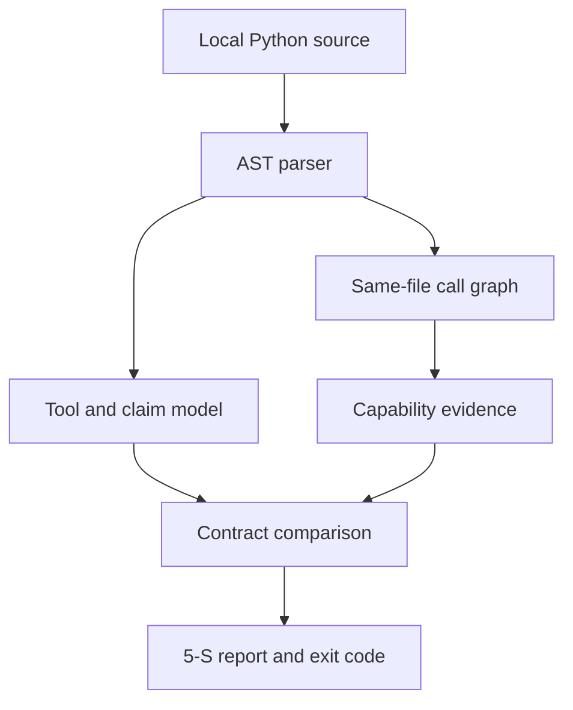

# Architecture and threat model

## Goal

MCP ScopeCheck detects mismatches between a Python MCP tool's declared contract and security-relevant behavior statically reachable from that tool.

## Non-goals

v0.1 is not a general Python SAST engine, malware sandbox, dependency scanner, MCP client, or runtime policy gateway. It does not execute servers and does not claim complete program analysis.

## Data flow

The target is data throughout this flow. Nothing imports the target or invokes its decorators.

## Trust boundaries

- **Untrusted:** every byte under the audit target.
- **Trusted:** ScopeCheck's parser, rule engine, renderer, and Python runtime.
- **External systems:** none during a v0.1 audit. The scanner has no network feature and no runtime dependency.

## Terminal-output boundary

Every target-controlled value passes through one display escaping function before
it reaches the plain-text report or a normal CLI error. C0 and C1 controls, DEL,
carriage returns, line feeds, tabs, Unicode line separators, and Unicode
bidirectional formatting controls are rendered as visible `\uXXXX` sequences.
Ordinary Unicode remains readable. ScopeCheck does not currently expose a JSON or
other machine-readable report format.

## Safety limits

- Symlinked source files are skipped.
- Known dependency/cache/build directories are skipped.
- Individual source files are limited to 1 MB.
- A directory audit is limited to 5,000 Python files.
- Static decorator metadata accepts only bounded JSON-like values. Each tool's
  metadata is limited to 256 decoded nodes, 12 nesting levels, 16,384 UTF-8
  string bytes, 256-bit integers, and 128 collection items.
- Calls, comprehensions, sets, dictionary expansion, and other executable or
  unsupported metadata syntax are rejected. `ToolAnnotations(...)` is handled
  as an explicitly supported static keyword container; it is never invoked.
- Syntax/read failures are reported as diagnostics instead of silently ignored.
- A symlink supplied as the audit target is rejected, and symlinked Python files found inside a directory target are skipped.

Invalid or over-budget tool metadata keeps the discovered tool visible but adds
a deterministic diagnostic, makes the audit incomplete, and yields exit `2`.
Unexpected internal ScopeCheck exceptions are not converted into target errors.

## Reachability model

The root of analysis is each discovered module-level tool function. Direct calls to named functions in the same file are followed transitively. Calls across modules, aliases assigned at runtime, decorators that register tools dynamically, and higher-order dispatch are outside v0.1.

This boundary matters: “reachable” in v0.1 means *reachable under this conservative same-file model*, not reachable under every possible Python execution.

## Finding philosophy

Capabilities are facts about code structure; they are not automatically vulnerabilities. For example, filesystem read behavior is expected for a documentation search tool. Findings are emitted when:

- a declared claim conflicts with an observed capability;
- sensitive behavior is undisclosed or insufficiently constrained; or
- behavior is inherently high-risk in an agent-controlled tool boundary.

Every finding carries a file, line, and symbol. Rules should prefer a narrow, explainable result over a high-volume keyword match.

`MSC103` requires a recognized containment comparison such as `relative_to`, `is_relative_to`, or `commonpath`; path normalization with `resolve()` alone is not treated as containment. The rule still does not prove that a guard dominates a filesystem sink or compares against the correct trusted root.

`MSC105` follows direct environment reads and simple name-to-name or payload assignments in lexical order within one reachable function. It is not control-flow-sensitive, interprocedural, field-sensitive, or a general taint engine.
